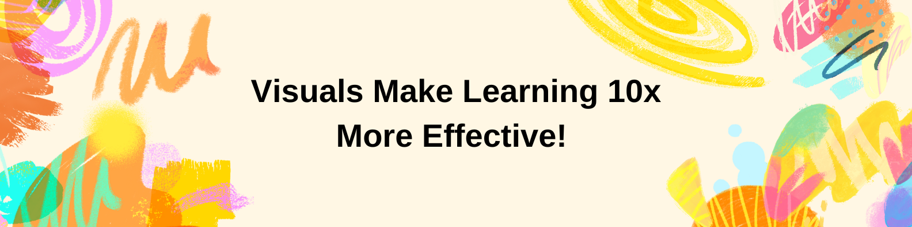
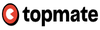
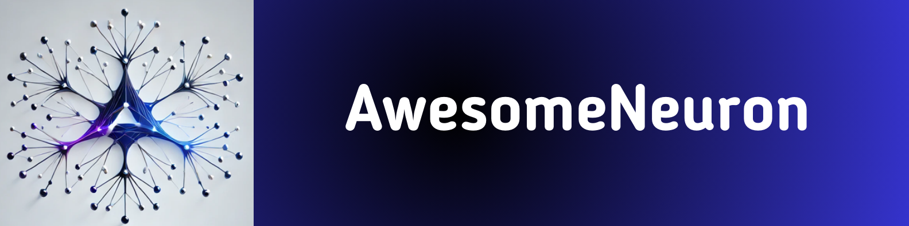
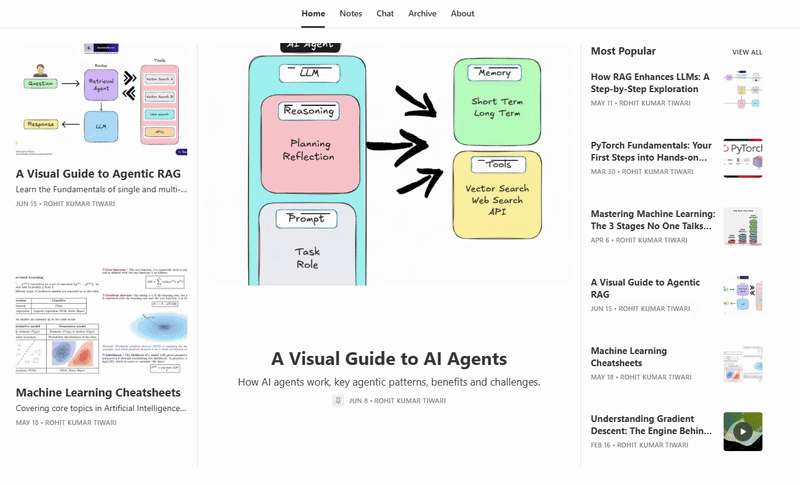

<h1 align="center">Hi, I'm Rohit👋</h1>

  
  
   
     
     

🔭 A Senior Data Scientist with a decade of experience.  
🌱 AI/ML expert for Telecom, Aerospace, Food Safety & Automotive industries.  
⚡ I specialize in building GenAI, NLP and Computer Vision solutions.

<h3 align="left">🚀 What I Do</h3>

🤖 Machine Learning / Deep Learning
✨ Generative AI, LLMs, and Agents
🧠 Natural Language Processing (NLP)
📸 Computer Vision 

<h3 align="left">📬 Newsletter</h3>

📌 Join 10,000+ ML enthusiasts and professionals from 150+ countries. 
✅ Learn AI for FREE with visuals, easy-to-follow insights. 
✅ Get cutting-edge topics like GenAI, RAGs, and LLMs in your inbox every week.

 

    <a href="https://awesomeneuron.substack.com/">
        

  

<h3 align="left">📊 GitHub Stats</h3>

    

   

  